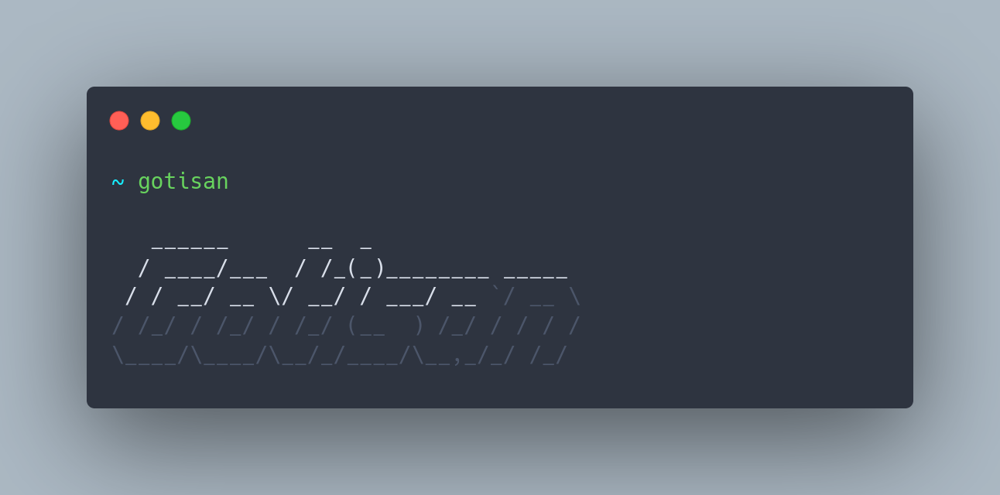

# Gotisan

gotisan is the command line interface inspider by laravel artisan for your golang projects that give you flexibility to have your customer file structures.


## Why should use this package?

- doing comfortable tasks such as creating new handler, model or DTO
- flexibility to have your own file structure with using template files

## Installation

can easly install this package in your local machine and use it in your golang projects. for installing this package just run below command in your terminal.

```bash
  go install github.com/adel-hadadi/gotisan
```

## Usage
to start using this package in our project just should go in your root directory of project and first of all run `init` command.

``` bash
gotisan init 
```
this command will create a `.gotisan` folder in your root direcoty that contain template files. if you using git in your project, gotisan will add .gotisan folder in .gitignore file.


#### Make Handler
``` bash
gotisan make:handler [name] [options]
```

by default above command will create a handler with this structure:
``` go
package handlers

type UserHandler struct {

}

func (c *UserHandler) InitUserHandler() {

}
``` 
but if you want a customer handler structure just go in `.gotisan/templates/handler.tmp` and customize to what you want.

by passing `-r` or `--restful` to `make:handler` command, package will create a restful handler with CRUD methods.

``` go
package handlers

import (

"net/http"

)

type UserHandler struct {

}

func (c *UserHandler) InitUserHandler() {

}


func (c *UserHandler) Index(w http.ResponseWriter, r *http.Request) {

}


func (c *UserHandler) Store(w http.ResponseWriter, r *http.Request) {

}

func (c *UserHandler) Update(w http.ResponseWriter, r *http.Request) {

}


func (c *UserHandler) Delete(w http.ResponseWriter, r *http.Request) {

}

```

## Make Model
